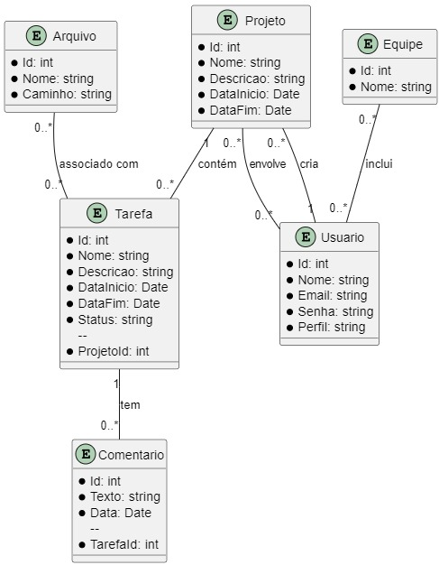

# Project Manager

Este é um sistema de gerenciamento de projetos desenvolvido em ASP.NET MVC. Ele permite que os usuários criem e gerenciem projetos, tarefas, equipes e usuários associados.

## Funcionalidades

- **Gerenciamento de Projetos**: Crie, edite e visualize projetos, incluindo a listagem de usuários associados ao projeto.
- **Gerenciamento de Tarefas**: Adicione, edite e remova tarefas para cada projeto. Cada tarefa pode ter comentários e arquivos associados.
- **Gerenciamento de Equipes**: Crie e gerencie equipes, adicionando e removendo usuários.
- **Gerenciamento de Usuários**: Usuários podem se registrar, fazer login, entrar em projetos e equipes.
- **Autenticação e Autorização**: Sistema de login seguro com diferentes níveis de acesso para gerentes e membros.

## Tecnologias Utilizadas

- ASP.NET MVC
- Entity Framework
- SQL Server
- Bootstrap

## Requisitos

- Visual Studio 2019 ou superior
- SQL Server
- .NET Framework 4.7.2 ou superior

## Configuração do Ambiente

1. Clone o repositório para a sua máquina local.
   ```bash
   git clone https://github.com/seu-usuario/project-manager.git

2. Depois de entrar no projeto 
   ```bash
   Update-Package -reinstall

3. Criar o banco de dados
   ```bash
   Update-Database
   
4. UML
   

5. Configurando o mailtrap
   Criar conta no mailtrap e usar as credenciais de login e senha criadas.
   

   e substitui-las no arquivo "projectManage/projectManage/Controllers/AccountController.cs" na função "SendConfirmationEmail"

